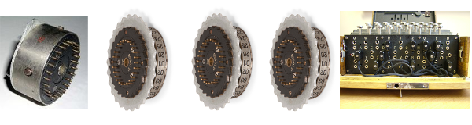

# This is EnigmASM...
... an implementation of the classic Enigma machine in x86-64 NASM assembly, for Linux.  By Kenneth Callow.

## Features:
 - Can encrypt text line by line, or character by character.
 - Reads custom rotors and configuration from file.
 - Shows the encryption sequence and current state of rotors, plugboard and reflector, and thus can be useful in teaching the workings of this machine.
 - Code consists mainly of macro modules, which can be easily reused.
 - Includes a prototype of the program in C, which can illustrate how to translate high level languages to NASM, using macros.

## Limitations:
 - Can only encrypt text up to 4096 chars (though this can be easily redefined in Main.asm).
 - For the purposes of "pretty printing", screen is cleared and printed each time a character is encrypted.  This breaks somewhat the Unix philosophy of having program output to standard output in a useful manner for other programs reading from standard input.
 - To use line mode, one must give a nonempty fourth argument. Thus one cannot use line mode without loading extra rotors.
 - Cannot delete chars once they are encrypted.
 - Encrypts only uppercase ASCII characters.
 - Not a very good encryption algorithm in current computing.

## Getting started:
  1. Download the source and decompress.
  2. Type 'make' in the source's directory.
	- NOTE: Makefile uses YASM as assembler.  To use NASM, open 'Makefile' and change the 'ASSEMBLER' variable's value from 'yasm' to 'nasm'.
  3. You should now have an executable called 'Main'.  To run it, type './Main config.txt rotors.txt'.  This uses the example config and extra rotors file.  Do './Main' to see full usage.
  4. Start typing capital letters.  You will see how the rotors rotate each time, and see the sequence of letters passed to encrypt your letter.  Whitespace, punctuation, numbers, and lowercase letters are not encrypted.  Type Ctrl-C when done.

## Who's who in the source:
  - Main.asm: name says it all.  Contains macros for loading the configuration and rotors from files, and to print current state of program.
  - Enigma.mac: declares the Rotor data structure, and its getters, printer and constructor.  Contains the core elements of the code: all encryption is handled here. 
  - String.mac: contains macros for string comparison, length and clearing.
  - System.mac: declares useful macro wrappers around the read, write, open, and close system calls.
  - Itoa.mac: implements integer<->string conversions.
  - Roman.mac: implements roman->integer conversion, for n < 9.
  - IO.asm: activates/deactivates raw mode.  This allows to read characters as soon as they are inputted, as opposed to waiting until Return is pressed.  
  	- NOTE: IO.asm is legacy 32 bit code, and needs to be updated to 64 bits.

## The algorithm:
 - An Enigma machine possesses five encryption elements: the reflector, the left, middle and right rotors, and the plugboard.  These five calculate permutations (and their inverses) over the English alphabet: they take a letter and output another, all inputs have distinct outputs (injectivity), all possible outputs have an input which will produce them (surjectivity).  When the permutation is being calculated, I will say the input "enters from the right", and when the inverse is calculated, "enters from the left".  The reflector is a special case that possesses a symmetric relation: if x is the output of y, then y is the output of x.  The permutation given by a rotor varies according to its rotation: the rotation offsets the input (modulo 26).  The plugboard and reflector remain fixed on a single permutation.
 
 - The elements work together as follows:
     - the user input enters the plugboard,
     - the plugboard's output enters the right rotor from the right, the rotor rotates,
     - the right rotor's output enters the middle rotor from the right, the middle rotor rotates if the right one has rotated a multiple of 26 times,
     - the middle rotor's output enters the left rotor from the right, the left rotor rotates if the middle one has rotated a multiple of 26 times,
     - the left rotor's output enters the reflector from the right,
     - the reflector's output enters the left rotor from the left,
     - the left rotor's output enters the middle rotor from the left,
     - the middle rotor's output enters the right rotor from the left,
     - the right rotor's output enters the plugboard from the left,
     - the plugboard's output is displayed.

## The implementation:
 - All encryption elements are represented by the Rotor data structure, with the reflector and plugboard with a fixed rotation of 0.  The program itself is self-explanatory.
